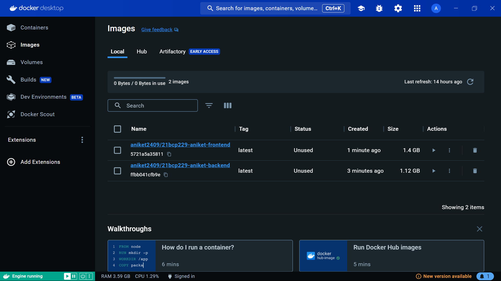
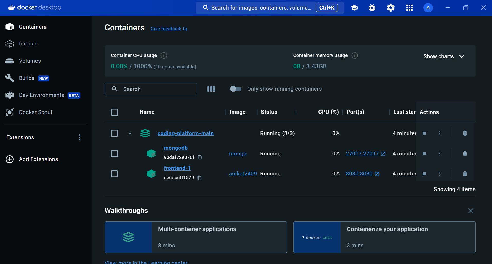

# Using Docker Images from Docker Hub: A Step-by-Step Guide
In this guide, I'll walk you through the process of pulling and running Docker images for both the backend and frontend of our application.

## Table of Contents

1. [Prerequisites](#prerequisites)
2. [Pulling Docker Images](#pulling-docker-images)
3. [Running the Backend](#running-the-backend)
4. [Running the Frontend](#running-the-frontend)

## 1. Prerequisites

Before you begin, ensure that you have Docker installed on your system. You can download Docker Desktop for Windows or Mac, or install Docker Engine on Linux. Make sure Docker is up and running.

## Docker File Explanation
## a. Backend Dockerfile
```bash
FROM node:latest

WORKDIR /

COPY . .

RUN npm install

EXPOSE 5001

CMD ["npm", "run", "start"]
```
## Explanation
Certainly! Below is the Dockerfile with explanations for each line, formatted in markdown:

```Dockerfile
# FROM node:latest
```
This line specifies the base image to be used for building this Docker image. Here, it pulls the latest version of the official Node.js image from Docker Hub. This image contains Node.js runtime and npm (Node Package Manager).

```Dockerfile
# WORKDIR /
```
Sets the working directory inside the container where subsequent commands will be executed. In this case, it sets the root directory ("/") as the working directory.

```Dockerfile
# COPY . .
```
Copies files from the Docker build context (the current directory where the Dockerfile is located) into the container's filesystem. The first dot (".") represents the files to be copied from the build context, and the second dot (".") represents the destination directory in the container, which is the same as the working directory set earlier.

```Dockerfile
# RUN npm install
```
Runs the npm install command inside the container. This command installs the dependencies specified in the package.json file of the project. It's typically used to install Node.js modules required by the application.

```Dockerfile
# EXPOSE 5001
```
Informs Docker that the container listens on a specific network port at runtime. It does not actually make the port accessible from outside the container; it's more of a documentation mechanism. In this case, it indicates that the application running inside the container will listen for incoming connections on port 5001.

```Dockerfile
# CMD ["npm", "run", "start"]
```
Specifies the default command to be executed when the container starts. It provides a way to run the application or services within the container. Here, it runs the npm run start command, which typically starts the Node.js application. The command is specified as an array, where each element represents a part of the command and its arguments. In this case, it runs "npm run start". The use of an array rather than a single string ensures that command arguments are correctly passed.

## b. Frontend Dockerfile
```bash
FROM node:latest

WORKDIR /app

COPY . .

RUN npm install 

EXPOSE 8080

CMD [ "npm", "run", "dev","--","--host","0.0.0.0"]
```

## Explanation
Sure, here's the Dockerfile with explanations for each line in markdown format:

```Dockerfile
# FROM node:latest
```
Specifies the base image to be used for building this Docker image. In this case, it pulls the latest version of the official Node.js image from Docker Hub.

```Dockerfile
# WORKDIR /app
```
Sets the working directory inside the container where subsequent commands will be executed. Here, it sets the directory "/app" as the working directory.

```Dockerfile
# COPY . .
```
Copies files from the Docker build context (the current directory where the Dockerfile is located) into the container's filesystem. The first dot (".") represents the files to be copied from the build context, and the second dot (".") represents the destination directory in the container, which is the working directory set earlier.

```Dockerfile
# RUN npm install 
```
Runs the npm install command inside the container. This command installs the dependencies specified in the package.json file of the project. It's typically used to install Node.js modules required by the application.

```Dockerfile
# EXPOSE 8080
```
Informs Docker that the container listens on a specific network port at runtime. It does not actually make the port accessible from outside the container; it's more of a documentation mechanism. In this case, it indicates that the application running inside the container will listen for incoming connections on port 8080.

```Dockerfile
# CMD [ "npm", "run", "dev","--","--host","0.0.0.0"]
```
Specifies the default command to be executed when the container starts. It provides a way to run the application or services within the container. Here, it runs the npm run dev command with additional arguments "-- --host 0.0.0.0". The command is specified as an array, where each element represents a part of the command and its arguments. In this case, it runs "npm run dev -- --host 0.0.0.0". The use of an array rather than a single string ensures that command arguments are correctly passed.

## c. Docker Compose File
```bash
version: '3'

services:
  frontend:
    image: aniket2409/21bcp229-aniket-frontend
    ports:
      - "8080:8080"

  backend:
    image: aniket2409/21bcp229-aniket-backend
    ports:
      - "5000:5001"
    depends_on:
      - mongodb
    environment:
      - MONGO_URI=mongodb+srv://<mongo_username>:<mongo_password>@cluster1.b9vwxsl.mongodb.net/test

  mongodb:
    image: mongo
    container_name: mongodb
    ports:
      - "27017:27017"
    environment:
      - MONGO_INITDB_DATABASE=test
      - MONGO_INITDB_ROOT_USERNAME=<mongo_username>
      - MONGO_INITDB_ROOT_PASSWORD=<mongo_password>
```

## Explanation
Here's the Docker Compose file with explanations for each section:

```yaml
version: '3'
```
Specifies the version of the Docker Compose file format being used. In this case, it's version 3.

```yaml
services:
```
Defines the services that make up the application. Each service represents a container.

```yaml
  frontend:
    image: aniket2409/21bcp229-aniket-frontend
```
Defines a service named "frontend" using a pre-built Docker image named "aniket2409/21bcp229-aniket-frontend". This image likely contains the frontend application.

```yaml
    ports:
      - "8080:8080"
```
Specifies port mapping for the frontend service. It maps port 8080 on the host to port 8080 on the container.

```yaml
  backend:
    image: aniket2409/21bcp229-aniket-backend
```
Defines a service named "backend" using a pre-built Docker image named "aniket2409/21bcp229-aniket-backend". This image probably contains the backend application.

```yaml
    ports:
      - "5000:5001"
```
Specifies port mapping for the backend service. It maps port 5000 on the host to port 5001 on the container.

```yaml
    depends_on:
      - mongodb
```
Specifies that the backend service depends on the "mongodb" service. Docker Compose will start the "mongodb" service before starting the "backend" service.

```yaml
    environment:
      - MONGO_URI=mongodb+srv://<mongo_username>:<mongo_username>@cluster1.b9vwxsl.mongodb.net/test
```
Sets environment variables for the backend service. In this case, it sets the MONGO_URI variable with the MongoDB connection URI.

```yaml
  mongodb:
    image: mongo
    container_name: mongodb
```
Defines a service named "mongodb" using the official MongoDB Docker image. It sets the container name to "mongodb".

```yaml
    ports:
      - "27017:27017"
```
Specifies port mapping for the MongoDB service. It maps port 27017 on the host to port 27017 on the container.

```yaml
    environment:
      - MONGO_INITDB_DATABASE=test
      - MONGO_INITDB_ROOT_USERNAME=<mongo_username>
      - MONGO_INITDB_ROOT_PASSWORD=<mongo_password>
```
Sets environment variables for the MongoDB service. It initializes the MongoDB database with the specified name, username, and password.
## 2. Pulling Docker Images

First, you'll need to pull the Docker images for both the backend and frontend from Docker Hub. Open your terminal or command prompt and use the following commands:

```bash
docker pull <backend-image-name>
docker pull <frontend-image-name>
```

Replace `<backend-image-name>` and `<frontend-image-name>` with the names of the Docker images you uploaded to Docker Hub.

#### My backend image - 
```bash 
aniket2409/21bcp229-aniket-backend
```
#### My frontend image - 
```bash
aniket2409/21bcp229-aniket-frontend
```


## 3. Running the Backend

Once you have pulled the backend Docker image, you can run it as a Docker container. Use the following command:

```bash
docker run -d --name=21bcp229-aniket-backend -e MONGO_URI=<mongo_uri> -p 5002:5001 <backend-image-name>
```

Replace `<backend-image-name>` with the name of the backend Docker image you pulled earlier. This command will run the backend container in detached mode and map port 5002 on your local machine to port 5001 in the container.

## 4. Running the Frontend

Similarly, you can run the frontend Docker container using the following command:

```bash
docker run -d --name=21bcp229-aniket-frontend -p 8080:8080 <frontend-image-name>
```

## 5. Using Docker compose

To run the backend and frontend containers together using Docker Compose, create a `docker-compose.yml` file with the following content:

```bash
docker compose up
```

## 6. Docker Desktop 

#### a. Images in docker desktop


#### b. Running containers in docker desktop




That's it! You now have both the backend and frontend of the application running as Docker containers on your local machine. You can access the application by navigating to `http://localhost:8080` in your web browser.

## Blog Post URL
- https://aniket-suthar.github.io/

#### Feel free to adjust the placeholders and commands as needed for your specific backend and frontend Docker images! Happy containerizing!